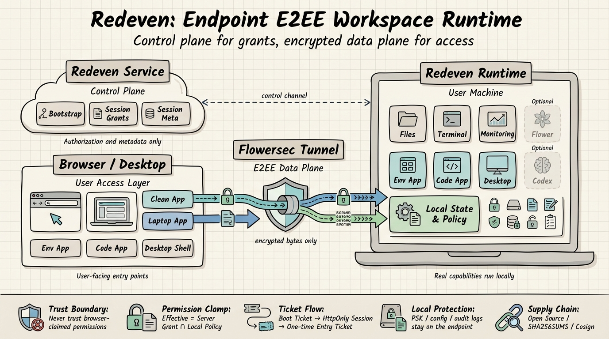

<p align="center">
  
</p>

# Redeven

<p align="center">
  <strong>Secure the real machine, not just the browser tab. 🔐⚡</strong><br>
  Turn any machine into an end-to-end encrypted workspace endpoint for files, terminals, monitoring, codespaces, desktop access, and AI-assisted workflows.
</p>

<p align="center">
  <a href="https://github.com/floegence/redeven/releases">Get Desktop</a> |
  <a href="#quick-start">Install CLI</a> |
  <a href="#capabilities">Explore Capabilities</a> |
  <a href="#docs-by-task">Open Docs</a> |
  <a href="https://github.com/floegence/flowersec">Flowersec</a> |
  <a href="https://github.com/floegence/floe-webapp">floe-webapp</a>
</p>

<p align="center">
  <a href="https://go.dev/"></a>
  <a href="https://nodejs.org/"></a>
  <a href="#security-at-a-glance"></a>
  <a href="https://github.com/floegence/flowersec"></a>
  <a href="https://github.com/floegence/floe-webapp"></a>
  <a href="docs/DESKTOP.md"></a>
  <a href="docs/CODE_APP.md"></a>
  <a href="docs/AI_AGENT.md"></a>
  <a href="https://github.com/floegence/redeven/releases"></a>
  <a href="#open-source-scope"></a>
</p>

Redeven is the endpoint/runtime that actually lives on the user machine. The service layer issues grants, [Flowersec](https://github.com/floegence/flowersec) carries encrypted bytes, and shared frontend interaction patterns can build on released [floe-webapp](https://github.com/floegence/floe-webapp) packages.

**Why it feels different**
- 🔐 Plaintext stays where it belongs: on the endpoint.
- 🧭 One runtime unlocks Env App, Code App, Desktop Shell, Flower, and Codex.
- 📦 The same contract ships as both CLI and desktop artifacts through auditable GitHub Releases.



**Architecture at a glance**
- `Redeven Service` stays in the control plane and issues bootstrap payloads, grants, and immutable session metadata.
- `Browser / Desktop` stay user-facing while `Flowersec Tunnel` carries encrypted bytes between the client and the endpoint runtime.
- `Redeven Runtime` terminates sessions on the user machine, enforces the local permission cap, and hosts the real files, terminal, monitoring, and app surfaces.
- Local state such as config, PSKs, audit logs, and diagnostics stays on the endpoint, while releases remain auditable through published checksums and signatures.

## Why teams use it

A secure endpoint should feel powerful, not heavy-handed. Redeven keeps the control plane lean while giving the user machine the real runtime surface. ✨

- Keep application data on the endpoint while the control plane only issues grants and metadata.
- Give users one entry point for files, terminals, monitoring, codespaces, and optional AI workflows.
- Ship the same runtime as a CLI and as a desktop app, with versioned GitHub Release artifacts and verification steps.

## Key technologies

| Technology | Role in Redeven | Jump |
| --- | --- | --- |
| [Flowersec](https://github.com/floegence/flowersec) | End-to-end encrypted transport for runtime sessions and byte forwarding | [Open repository](https://github.com/floegence/flowersec) |
| [floe-webapp](https://github.com/floegence/floe-webapp) | Shared frontend building blocks and interaction semantics for Redeven surfaces | [Open repository](https://github.com/floegence/floe-webapp) |
| Go | Core runtime, CLI, session handling, and embedded services | [Install Go](https://go.dev/) |
| Electron | Desktop shell that wraps Redeven Local UI with native UX and diagnostics | [`docs/DESKTOP.md`](docs/DESKTOP.md) |

## Capabilities

| Surface | What users get | Why it matters | Docs |
| --- | --- | --- | --- |
| `Env App` 🗂️ | Deck, terminal, monitoring, file browser, codespaces, port forwarding, Runtime Settings | One secure workspace view for day-to-day endpoint operations | [`docs/ENV_APP.md`](docs/ENV_APP.md) |
| `Code App` 💻 | code-server over Flowersec E2EE proxying for HTTP and WebSocket traffic | Browser IDE access without exposing the editor directly to the control plane | [`docs/CODE_APP.md`](docs/CODE_APP.md) |
| `Desktop Shell` 🖥️ | Native Electron app that opens this device or another Redeven Local UI | Local UX, Connection Center, Advanced Settings, connection management, blocked-state handling, and diagnostics in a desktop wrapper | [`docs/DESKTOP.md`](docs/DESKTOP.md) |
| `Flower` (optional) 🌸 | AI workflows that can start from terminal, file, and monitoring context | AI assistance stays attached to the same endpoint runtime and permission model | [`docs/AI_AGENT.md`](docs/AI_AGENT.md), [`docs/AI_SETTINGS.md`](docs/AI_SETTINGS.md) |
| `Codex` (optional) 🤖 | Independent Codex conversation threads backed by the host machine's `codex app-server` | Keeps Codex UI, official Codex branding, and upgrade cadence separate from Flower while giving Codex its own navigator/chat shell inside Env App | [`docs/CODEX_UI.md`](docs/CODEX_UI.md) |

## Example workflows

| Use case | Flow | Outcome |
| --- | --- | --- |
| Secure remote environment access 🔐 | Open Env App, inspect files, attach a terminal, and check monitoring panels | Operate on the user machine without routing plaintext application traffic through the control plane |
| Browser-based development ⚙️ | Launch a codespace from Env App, explicitly install the managed runtime if prompted, then move into Code App | Reach code-server through the local runtime gateway and Flowersec E2EE proxy |
| Desktop operations 🖥️ | Start Redeven Desktop on this device or connect it to another Redeven Local UI | Use Connection Center, Advanced Settings, diagnostics, and shell-owned connection management around the same runtime contract |

## Quick start

From zero to a live endpoint in a few minutes. 🚀

### 1. Install the CLI

```bash
curl -fsSL https://raw.githubusercontent.com/floegence/redeven/main/scripts/install.sh | sh
```

If you want the native desktop app instead, download the installers from [GitHub Releases](https://github.com/floegence/redeven/releases).

### 2. Bootstrap once

```bash
redeven bootstrap \
  --controlplane https://<redeven-environment-host> \
  --env-id <env_public_id> \
  --env-token <env_token>
```

Bootstrap writes the default local config to `~/.redeven/config.json` and applies the local permission cap preset `execute_read_write`.

### 3. Run the endpoint

```bash
redeven run --mode hybrid
```

Expected result:

- `redeven run` starts without config validation errors.
- The Redeven service shows the endpoint online.
- Env App can open basic file and terminal actions over E2EE sessions.

### 4. Pick the runtime shape you need

| Goal | Command |
| --- | --- |
| Local UI only on this machine | `redeven run --mode local` |
| Local UI plus remote control channel | `redeven run --mode hybrid` |
| Desktop-managed runtime | `redeven run --mode desktop --desktop-managed --local-ui-bind 127.0.0.1:0` |
| Expose Local UI to another trusted machine | `REDEVEN_LOCAL_UI_PASSWORD=<long-password> redeven run --mode hybrid --local-ui-bind 0.0.0.0:24000 --password-env REDEVEN_LOCAL_UI_PASSWORD` |

## Security at a glance

Security posture first, convenience second. 🔒

| Topic | Public contract |
| --- | --- |
| Trust boundary | The runtime does not trust browser-claimed permissions. Effective permissions come from server-issued session grants, clamped by local policy. |
| Control plane vs data plane | Management traffic issues grants and metadata. [Flowersec](https://github.com/floegence/flowersec) forwards encrypted bytes and cannot decrypt application data. |
| Local secrets | Local config contains sensitive material, including E2EE PSKs, so the state directory must stay private to the local account. |

Read the full contract in [`docs/CAPABILITY_PERMISSIONS.md`](docs/CAPABILITY_PERMISSIONS.md) and [`docs/PERMISSION_POLICY.md`](docs/PERMISSION_POLICY.md).

## Frontend accessibility baseline

Accessibility is part of the product contract, not a late-stage polish pass. ♿

- Env App and Desktop target a WCAG 2.2 AA baseline for keyboard access, visible focus, semantic landmarks, motion reduction, and contrast-sensitive text.
- Shared interaction semantics should come from released `@floegence/floe-webapp-*` packages first. Product-owned Redeven widgets should only add app-specific accessibility behavior on top of those primitives.
- Custom widgets must use real interactive elements, preserve visible focus indicators, and keep keyboard behavior aligned with their semantic role instead of relying on clickable containers or one-off ARIA patches.
- Contributor guidance for the two frontend surfaces lives in [`docs/ENV_APP.md`](docs/ENV_APP.md) and [`docs/DESKTOP.md`](docs/DESKTOP.md).

## Docs by task

Pick the shortest path to what you need. 📚

| I want to... | Read |
| --- | --- |
| Understand the Env App runtime and session flow | [`docs/ENV_APP.md`](docs/ENV_APP.md) |
| Run code-server over E2EE | [`docs/CODE_APP.md`](docs/CODE_APP.md) |
| Package or operate the desktop shell | [`docs/DESKTOP.md`](docs/DESKTOP.md) |
| Configure Flower and its settings | [`docs/AI_AGENT.md`](docs/AI_AGENT.md), [`docs/AI_SETTINGS.md`](docs/AI_SETTINGS.md) |
| Understand the optional Codex host-runtime integration | [`docs/CODEX_UI.md`](docs/CODEX_UI.md) |
| Review the permission contract | [`docs/CAPABILITY_PERMISSIONS.md`](docs/CAPABILITY_PERMISSIONS.md), [`docs/PERMISSION_POLICY.md`](docs/PERMISSION_POLICY.md) |
| Verify releases and artifacts | [`docs/RELEASE.md`](docs/RELEASE.md) |

## For developers

Build, lint, and verify from source. 🛠️

<details>
<summary>Build from source</summary>

### Prerequisites

- Go `1.25.8`
- Node.js `24`
- npm
- pnpm (or Node.js `corepack`)

### Build

```bash
./scripts/lint_ui.sh
./scripts/check_desktop.sh
./scripts/build_assets.sh
go build -o redeven ./cmd/redeven
```

### Local guardrails

```bash
./scripts/install_git_hooks.sh
```

Notes:

- `internal/**/dist/` assets are generated and embedded via Go `embed`.
- Generated `dist` assets are not checked into git.
- `./scripts/lint_ui.sh` validates the Env App and Code App source packages before asset bundling.
- `./scripts/check_desktop.sh` validates the Electron desktop shell package.
- `cd desktop && npm run start` and `cd desktop && npm run package` prepare `desktop/.bundle/<goos>-<goarch>/redeven` from the current repository before Electron starts or packages the desktop shell.

</details>

<details>
<summary>Local state, releases, and troubleshooting shortcuts</summary>

### Common local files

- `~/.redeven/config.json`
- `~/.redeven/agent.lock`
- `~/.redeven/secrets.json`
- `~/.redeven/audit/events.jsonl`
- `~/.redeven/diagnostics/agent-events.jsonl` for runtime-side request/direct-session diagnostics
- `~/.redeven/diagnostics/desktop-events.jsonl` when the same runtime is attached by Redeven Desktop
- `~/.redeven/apps/code/...`

Multi-environment mode uses isolated state per environment:

- `~/.redeven/envs/<env_public_id>/config.json`

### Public release contract

- GitHub Release is the source of truth for versioned CLI tarballs, desktop installers, and checksums.
- On `v*` tag push, `Release Redeven` publishes GitHub Release assets, checksums, signatures, and release notes with both highlights and a full change list.
- `scripts/install.sh` resolves versions from GitHub Releases and downloads release assets directly from GitHub.

Full details: [`docs/RELEASE.md`](docs/RELEASE.md)

### Common troubleshooting entry points

- `bootstrap failed` or `missing direct connect info`: verify `--controlplane`, `--env-id`, and `--env-token`.
- `code-server runtime missing or unusable`: open Env App -> Runtime Settings -> `code-server Runtime` and use the explicit install or update-to-latest flow, or set `REDEVEN_CODE_SERVER_BIN` to a usable binary path.
- `Missing init payload` in Codespaces: reopen the codespace from Env App so a new entry ticket can be minted.
- Desktop lock conflict: if another runtime instance already owns `~/.redeven`, stop it or restart it with a Local UI mode, then retry.
- Requests feel slow: open Runtime Settings -> Debug Console, then inspect the floating console to compare desktop, gateway, and UI timing.

</details>

## Open-source scope

Public, auditable, and intentionally scoped. 🌍

This public `redeven` repository describes the endpoint/runtime layer, Local UI behavior, and the GitHub Release contract.
Organization-specific deployment automation and environment-specific wrappers are intentionally out of scope for this repository.
