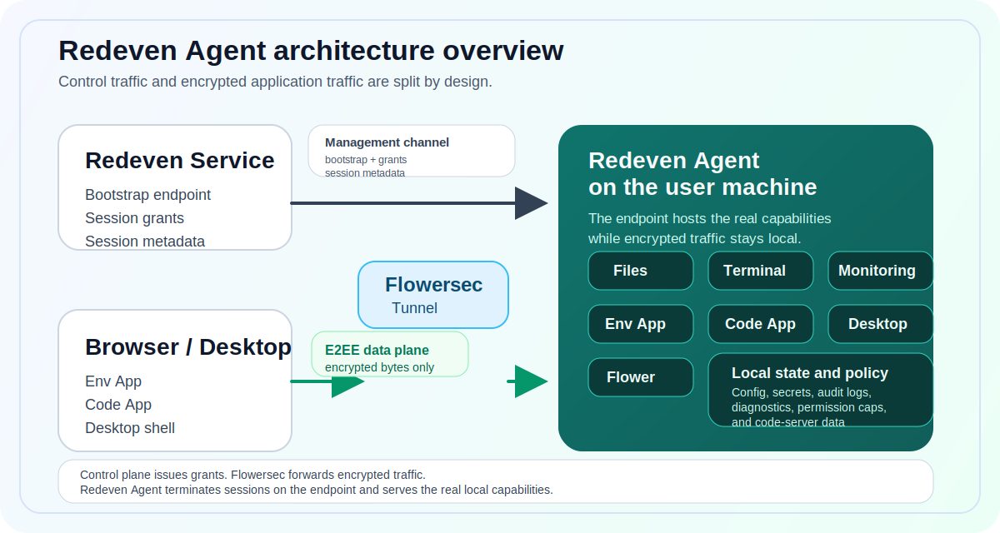

<p align="center">
  
</p>

# Redeven Agent

<p align="center">
  <strong>Turn any machine into a secure E2EE workspace endpoint for files, terminals, monitoring, codespaces, desktop access, and AI-assisted workflows.</strong>
</p>

<p align="center">
  <a href="https://github.com/floegence/redeven-agent/releases">Get Desktop</a> |
  <a href="#quick-start">Install CLI</a> |
  <a href="#capabilities">Explore Capabilities</a> |
  <a href="#docs-by-task">Open Docs</a>
</p>


Redeven Agent runs on the user machine. Redeven Service issues grants, Flowersec carries encrypted bytes, and the endpoint hosts the real application surfaces and local capabilities.

This repository stays open-source and auditable. It documents the public agent runtime, its Local UI behavior, and the public GitHub Release contract.



## Why teams use it

- Keep application data on the endpoint while the control plane only issues grants and metadata.
- Give users one entry point for files, terminals, monitoring, codespaces, and optional AI workflows.
- Ship the same runtime as a CLI and as a desktop app, with versioned GitHub Release artifacts and verification steps.

## Capabilities

| Surface | What users get | Why it matters | Docs |
| --- | --- | --- | --- |
| `Env App` | Deck, terminal, monitoring, file browser, codespaces, port forwarding, Agent Settings | One secure workspace view for day-to-day endpoint operations | [`docs/ENV_APP.md`](docs/ENV_APP.md) |
| `Code App` | code-server over Flowersec E2EE proxying for HTTP and WebSocket traffic | Browser IDE access without exposing the editor directly to the control plane | [`docs/CODE_APP.md`](docs/CODE_APP.md) |
| `Desktop Shell` | Native Electron app that opens this device or another Redeven Local UI | Local UX, Desktop Settings, connection management, blocked-state handling, and diagnostics in a desktop wrapper | [`docs/DESKTOP.md`](docs/DESKTOP.md) |
| `Flower` (optional) | AI workflows that can start from terminal, file, and monitoring context | AI assistance stays attached to the same endpoint runtime and permission model | [`docs/AI_AGENT.md`](docs/AI_AGENT.md), [`docs/AI_SETTINGS.md`](docs/AI_SETTINGS.md) |

## Example workflows

| Use case | Flow | Outcome |
| --- | --- | --- |
| Secure remote environment access | Open Env App, inspect files, attach a terminal, and check monitoring panels | Operate on the user machine without routing plaintext application traffic through the control plane |
| Browser-based development | Launch a codespace from Env App, then move into Code App | Reach code-server through the agent gateway and Flowersec E2EE proxy |
| Desktop operations | Start Redeven Desktop on this device or connect it to another Redeven Local UI | Use native Desktop Settings, diagnostics, and connection management around the same runtime contract |

## Quick start

### 1. Install the CLI

```bash
curl -fsSL https://raw.githubusercontent.com/floegence/redeven-agent/main/scripts/install.sh | sh
```

If you want the native desktop app instead, download the installers from [GitHub Releases](https://github.com/floegence/redeven-agent/releases).

### 2. Bootstrap once

```bash
redeven bootstrap \
  --controlplane https://<redeven-environment-host> \
  --env-id <env_public_id> \
  --env-token <env_token>
```

Bootstrap writes the default local config to `~/.redeven/config.json` and applies the local permission cap preset `execute_read_write`.

### 3. Run the endpoint

```bash
redeven run --mode hybrid
```

Expected result:

- `redeven run` starts without config validation errors.
- The Redeven service shows the endpoint online.
- Env App can open basic file and terminal actions over E2EE sessions.

### 4. Pick the runtime shape you need

| Goal | Command |
| --- | --- |
| Local UI only on this machine | `redeven run --mode local` |
| Local UI plus remote control channel | `redeven run --mode hybrid` |
| Desktop-managed runtime | `redeven run --mode desktop --desktop-managed --local-ui-bind 127.0.0.1:0` |
| Expose Local UI to another trusted machine | `REDEVEN_LOCAL_UI_PASSWORD=<long-password> redeven run --mode hybrid --local-ui-bind 0.0.0.0:24000 --password-env REDEVEN_LOCAL_UI_PASSWORD` |

## Security at a glance

| Topic | Public contract |
| --- | --- |
| Trust boundary | The agent does not trust browser-claimed permissions. Effective permissions come from server-issued session grants, clamped by local policy. |
| Control plane vs data plane | Management traffic issues grants and metadata. Flowersec forwards encrypted bytes and cannot decrypt application data. |
| Local secrets | Local config contains sensitive material, including E2EE PSKs, so the state directory must stay private to the local account. |

Read the full contract in [`docs/CAPABILITY_PERMISSIONS.md`](docs/CAPABILITY_PERMISSIONS.md) and [`docs/PERMISSION_POLICY.md`](docs/PERMISSION_POLICY.md).

## Docs by task

| I want to... | Read |
| --- | --- |
| Understand the Env App runtime and session flow | [`docs/ENV_APP.md`](docs/ENV_APP.md) |
| Run code-server over E2EE | [`docs/CODE_APP.md`](docs/CODE_APP.md) |
| Package or operate the desktop shell | [`docs/DESKTOP.md`](docs/DESKTOP.md) |
| Configure Flower and its settings | [`docs/AI_AGENT.md`](docs/AI_AGENT.md), [`docs/AI_SETTINGS.md`](docs/AI_SETTINGS.md) |
| Review the permission contract | [`docs/CAPABILITY_PERMISSIONS.md`](docs/CAPABILITY_PERMISSIONS.md), [`docs/PERMISSION_POLICY.md`](docs/PERMISSION_POLICY.md) |
| Verify releases and artifacts | [`docs/RELEASE.md`](docs/RELEASE.md) |

## For developers

<details>
<summary>Build from source</summary>

### Prerequisites

- Go `1.25.8`
- Node.js `24`
- npm
- pnpm (or Node.js `corepack`)

### Build

```bash
./scripts/lint_ui.sh
./scripts/check_desktop.sh
./scripts/build_assets.sh
go build -o redeven ./cmd/redeven
```

### Local guardrails

```bash
./scripts/install_git_hooks.sh
```

Notes:

- `internal/**/dist/` assets are generated and embedded via Go `embed`.
- Generated `dist` assets are not checked into git.
- `./scripts/lint_ui.sh` validates the Env App and Code App source packages before asset bundling.
- `./scripts/check_desktop.sh` validates the Electron desktop shell package.
- `cd desktop && npm run start` and `cd desktop && npm run package` prepare `desktop/.bundle/<goos>-<goarch>/redeven` from the current repository before Electron starts or packages the desktop shell.

</details>

<details>
<summary>Local state, releases, and troubleshooting shortcuts</summary>

### Common local files

- `~/.redeven/config.json`
- `~/.redeven/agent.lock`
- `~/.redeven/secrets.json`
- `~/.redeven/audit/events.jsonl`
- `~/.redeven/diagnostics/agent-events.jsonl` when `log_level=debug`
- `~/.redeven/diagnostics/desktop-events.jsonl` for desktop-managed runs with diagnostics mode
- `~/.redeven/apps/code/...`

Multi-environment mode uses isolated state per environment:

- `~/.redeven/envs/<env_public_id>/config.json`

### Public release contract

- GitHub Release is the source of truth for versioned CLI tarballs, desktop installers, and checksums.
- On `v*` tag push, `Release Agent` publishes GitHub Release assets, checksums, signatures, and release notes.
- `scripts/install.sh` resolves versions from GitHub Releases and downloads release assets directly from GitHub.

Full details: [`docs/RELEASE.md`](docs/RELEASE.md)

### Common troubleshooting entry points

- `bootstrap failed` or `missing direct connect info`: verify `--controlplane`, `--env-id`, and `--env-token`.
- `code-server binary not found`: install `code-server`, or set `REDEVEN_CODE_SERVER_BIN` to an absolute path.
- `Missing init payload` in Codespaces: reopen the codespace from Env App so a new entry ticket can be minted.
- Desktop lock conflict: if another agent already owns `~/.redeven`, stop it or restart it with a Local UI mode, then retry.
- Requests feel slow: set `log_level=debug`, then use the diagnostics panel to compare desktop and agent timing.

</details>

## Open-source scope

This public repository describes the agent runtime, Local UI behavior, and the public GitHub Release contract. It does not document private downstream deployment wrappers.
